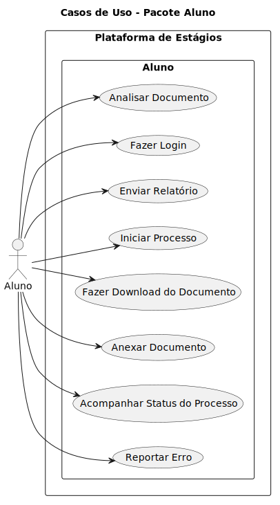
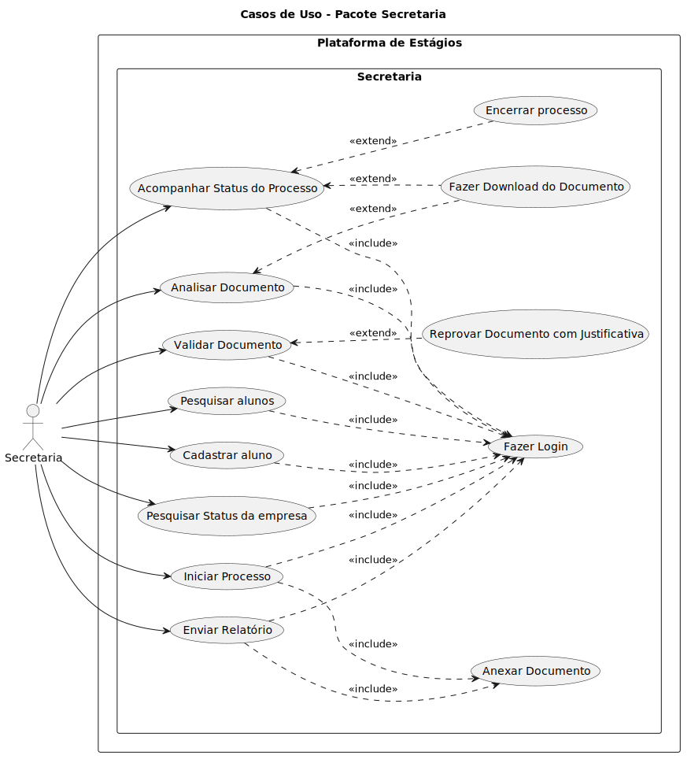

## Casos de Uso

Casos de uso são uma forma de representar e detalhar funcionalidades existentes no projeto. Eles se baseiam em interações entre atores e o sistema que possuam valor e concentram todas as informações não técnicas necessárias para a compreensão e implementação dos requisitos. 

### Índice:
- [Diagrama do Aluno](#casos_de_uso_aluno)
- [Diagrama da Secretaria](#casos_de_uso_secretaria)
- [Diagrama do Aluno](#casos_de_uso_coordenacao)

## Diagrama de Casos de Uso

Diagrama de Casos de Uso é uma representação gráfica de todas as interações que um ou mais atores podem ter com o sistema e como esses casos de uso se relacionam entre si. 

