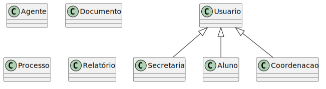

## Diagrama de Classes

O Diagrama de Classes descreve a estrutura estática do sistema, mostrando suas classes, atributos, métodos e os relacionamentos entre os objetos. No contexto do Sistema de Gestão de Estágios, ele detalha como as entidades como Aluno, Contrato, Relatório e Processo interagem.

## Descrição das Classes Principais

### Usuários e Perfis
O sistema utiliza uma estrutura de herança a partir da classe abstrata `Usuario`:
- **Aluno**: Entidade principal que inicia o processo de estágio. Cada aluno pode ter no máximo **um processo ativo** por vez.
- **Secretaria**: Responsável pela validação documental e gestão de múltiplos processos de alunos.
- **Coordenacao**: Responsável pela validação pedagógica do estágio, vinculada a uma **Area** acadêmica específica.

### Processo e Documentação
- **Processo**: Centraliza o ciclo de vida de um estágio, vinculando um aluno a seus documentos e status atual.
- **Contrato**: Armazena os dados do termo de compromisso, incluindo informações da empresa, vigência e status de assinaturas.
- **Relatorio**: Utilizado para o acompanhamento periódico das horas e atividades.

### Estrutura Acadêmica
- **Curso**: Define a qual curso o aluno pertence.
- **Area**: Agrupa cursos e define a responsabilidade da Coordenação.

## Considerações de Design

1.  **Auditoria Externa**: O sistema não armazena o histórico de ações internamente. Todas as operações de mudança de status e logs de auditoria são enviadas para um **servidor de logs próprio**, garantindo a separação de preocupações e performance.
2.  **Limitação de Processo**: Foi implementada a regra de que um aluno possui apenas um `processoAtual` (relação 1:0..1), evitando conflitos burocráticos.
3.  **Independência Documental**: `Contrato` e `Relatorio` são tratados como entidades distintas para facilitar a gestão de seus atributos específicos.
4.  **Uso de Enums**: `StatusProcesso`, `Unidade` e `Periodo` garantem a integridade dos dados e facilitam futuras manutenções.
