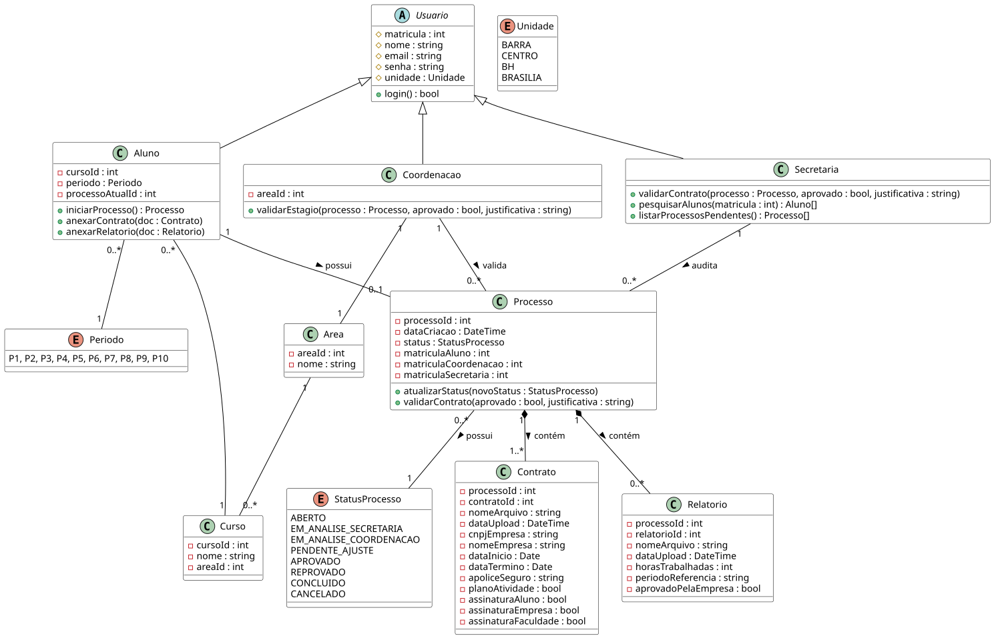
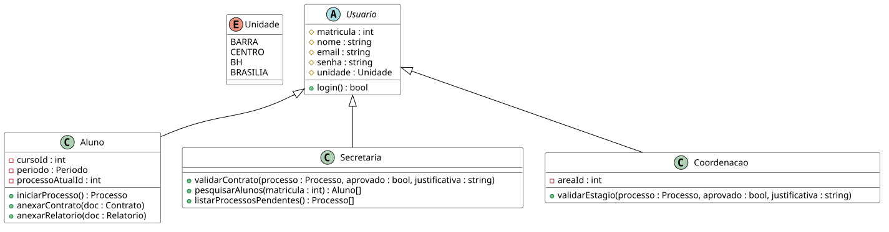
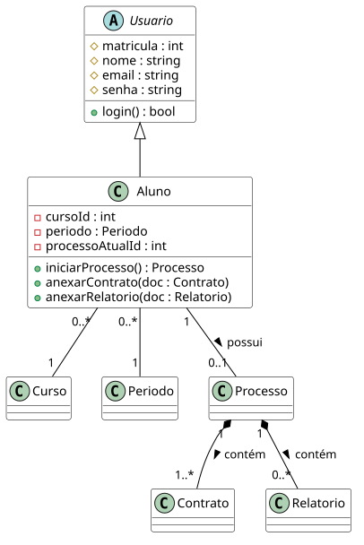
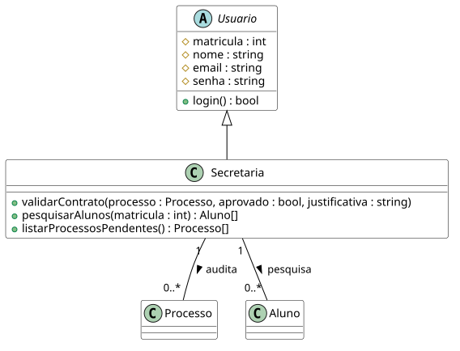
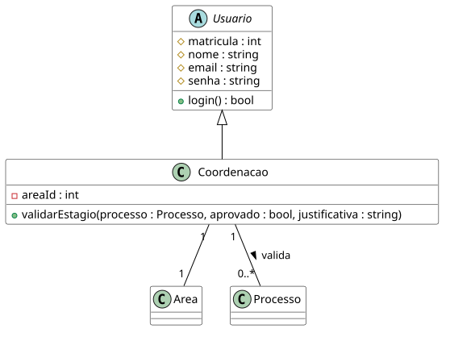
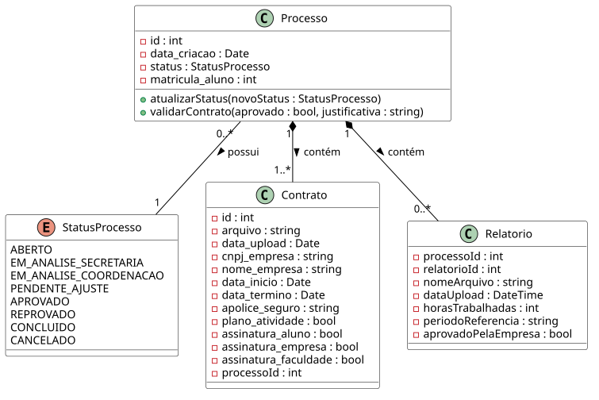
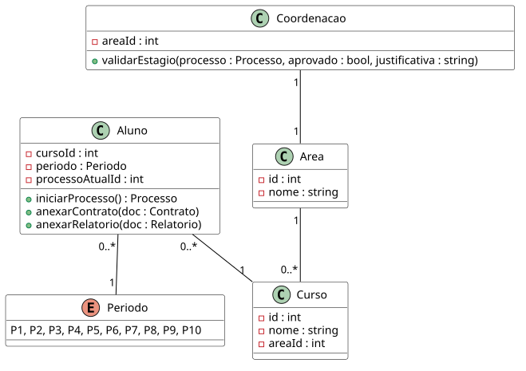

## Diagrama de Classes

O Diagrama de Classes descreve a estrutura estática do sistema, mostrando suas classes, atributos, métodos e os relacionamentos entre os objetos. No contexto do Sistema de Gestão de Estágios, ele detalha como as entidades como Aluno, Contrato, Relatório e Processo interagem.

## 🏷️ Enumerações (Enums)

Os Enums garantem a integridade dos atributos de controle no sistema, evitando erros de preenchimento.

| Enum | Propósito | Valores Aceitos |
| :--- | :--- | :--- |
| **`StatusProcesso`** | Regula o ciclo de vida do estágio. | `ABERTO`, `PENDENTE`, `REPROVADO`, `CONCLUIDO`, `CANCELADO` |
| **`StatusContrato`** | Define a situação atual do contrato. | `PENDENTE`, `EM_ANALISE_SECRETARIA`, `APROVADO`, `REPROVADO` |
| **`StatusRelatorio`** | Define a situação atual do relatório. | `PENDENTE`, `EM_ANALISE_COORDENACAO`, `APROVADO`, `REPROVADO` |
| **`Unidade`** | Define o campus do usuário. | `BARRA`, `BOTAFOGO` |
| **`Periodo`** | Representa o semestre atual do aluno. | `PRIMEIRO` ao `DECIMO` |
| **`Veredito`** | Define o resultado de uma avaliação. | `APROVADO`, `REPROVADO` |
| **`DiasDaSemana`** | Define os dias da semana para grade horária. | `SEGUNDA`, `TERCA`, `QUARTA`, `QUINTA`, `SEXTA`, `SABADO` |
| **`Turno`** | Define o turno de atividade. | `MANHA`, `TARDE`, `NOITE` |

---

## 👥 Usuários e Perfis

> [!NOTE]
> Todos os perfis do sistema herdam da classe abstrata **`Usuario`**, compartilhando credenciais essenciais como `matricula`, `nome`, `email`, `senha`, `unidade` e `precisa_redefinir_senha`, centralizando o método `login()`.

### 👨‍🎓 Aluno
O ator principal. Inicia o processo de estágio e faz o intermédio entre empresa e secretaria.

- **Relacionamentos:** Pertence a 1 `Curso` e 1 `Periodo`. Possui *apenas um* `processoAtual`. Possui uma `grade` horária (ManyToMany com `Horarios`).
- **Ações Principais:** `iniciarProcesso()`, `anexarContrato()`, `anexarRelatorio()`.

### 👩‍💼 Secretaria
Responsável pelo fluxo administrativo e validação do contrato.

- **Ações Principais:** `validarContrato()`, `pesquisarAlunos()`, `listarProcessosPendentes()`.

### 👨‍🏫 Coordenação
Decisor acadêmico. Avalia se o estágio está alinhado às diretrizes do curso e valida as horas feitas.

- **Relacionamentos:** Está vinculado a uma `Area` específica (a FK `coordenador` pertence ao model `Area`).
- **Ações Principais:** `validarEstagio()`.

---

## 📑 Processo e Documentação

### 🔄 Processo
O coração do sistema. Ele encapsula o ciclo do estágio conectando `Aluno`, `Secretaria` e `Coordenacao`.
- **Atributos:** `id`, `nome_empresa`, `data_criacao`, `status`, `aluno` (FK), `coordenacao` (FK), `secretaria` (FK), `criado_por`.
- **Composições:** Contém instâncias de `Contrato` (1..*) e `Relatorio` (0..*). Se o processo é extinto, os documentos associados também perdem o vínculo estrutural.
- **Transições:** Gerenciado internamente pelos métodos de validação e por `atualizarStatus()`.

### 📝 Contrato
O termo de compromisso formal de início.
- **Dados Relevantes:** Vigência (`data_inicio`, `data_termino`), dados do prestador (`cnpj_empresa`, `nome_empresa`), e `horarios_atividade` (ManyToMany com `Horarios`).
- **Validações:** Requer `apolice_seguro`, `plano_atividade` válidos e verificação boolean de todas as assinaturas (`assinatura_aluno`, `assinatura_empresa`, `assinatura_faculdade`).
- **Status:** Utiliza o enum `StatusContrato`.

### 📊 Relatório
Documento produzido pela empresa ao final do período de estágio para informar o que foi feito pelo estudante.
- **Dados Relevantes:** `horas_trabalhadas`, `data_inicio`, `data_termino`.
- **Validação:** Necessita do marcador de triagem externa `status` que utiliza o enum `StatusRelatorio`.

---

## 🏫 Estrutura Acadêmica

| Classe | Descrição | Relacionamentos |
| :--- | :--- | :--- |
| **`Curso`** | Identificação do programa de graduação do aluno. | Um aluno possui **1** Curso. Múltiplos cursos compõem **1** Área. |
| **`Area`** | Agrupamento taxonômico de cursos correlatos. | Possui de **0 a Muitos** Cursos e **1** `coordenador` (OneToOne FK para `Coordenador`). |
| **`Horarios`** | Grade horária com turno e dia da semana. | Vinculado a `Aluno` (ManyToMany via `grade`) e a `Contrato` (ManyToMany via `horarios_atividade`). Usa enums `Turno` e `DiasDaSemana`. |

---

## 💡 Considerações de Arquitetura e Design

> [!TIP]
> **Boas Práticas Adotadas:** Empregar tipos fortes (via Enums) em toda comunicação crítica minimiza a fragilidade das *magic strings* e garante estabilidade ao longo do crescimento do workflow.

1. **Auditoria Externa (Logs)**: O histórico meticuloso de ações e trâmites processuais deverá ser implementado fora do objeto relacional primário (em um sistema de *eventos/logs* à parte), assegurando leveza de payload e performance nas APIs do sistema nativo.
2. **Restrição por Modelagem (1:1)**: Um `Aluno` está inflexivelmente mapeado para a restrição de possuir um `processoAtual` por vez `(0..1)`. Isso inibe concorrências sistêmicas desleais com os tramites na central de estágios.
3. **Independência Documental Estratégica**: O `Contrato` atua formalmente na admissão enquanto o `Relatorio` age como controle sequencial; ao tratar-los como entidades apartadas — unificadas puramente pela amarração do Processo —  evita-se a sobreposição de complexidade na manutenção.
