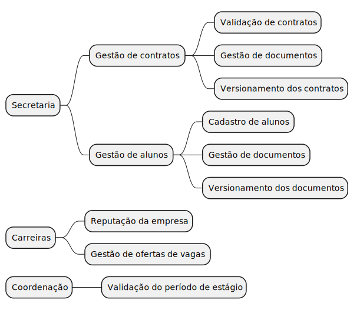
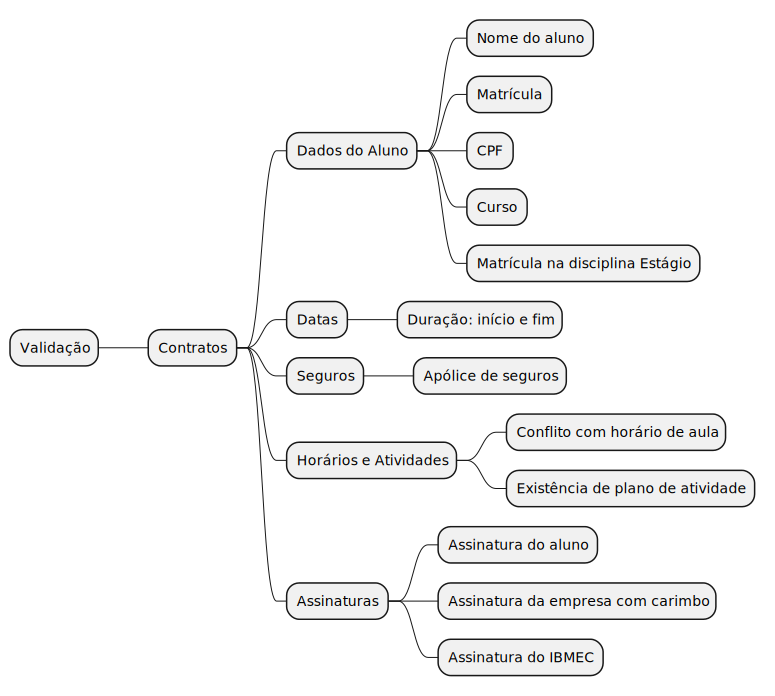
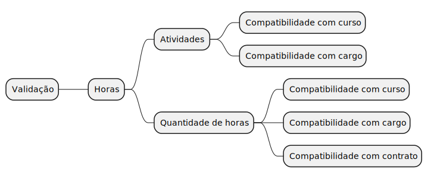

 
## 🚀 Introdução
 

Mapa mental consiste em criar resumos cheios de símbolos, cores, setas e frases de efeito com o objetivo de organizar o conteúdo e facilitar associações entre as informações destacadas. Esse material é muito indicado para pessoas que têm facilidade de aprender de forma visual.

 
 

    Os mapas mentais desse projeto tem como objetivo explicar de maneira fácil,clara e com menos barreira técnica possível todas as concepções acerca do projeto como problemas, soluções ou ciclos. 

## 🛠️ Metodologia
 

Foram levantados dados através de entrevistas com a Secretaria e pesquisas acerca de todo o processo documental e validação de estágio envolvendo Universidade e Empresa. Com os problemas em mãos foi mapeado todas as concepções lógicas para fácil acesso e consulta.

 
 
## 🧠 Mapas mentais
 
### 🔄 Ciclo do processo de estágio
 

 
 
### 👥 Responsabilidades da Secretaria
    

    A maior parte das tarefas que envolvem o processo de estágio é muito manual, simples e repetitiva, o que ocasiona uma maior chance de erros e cansaço desnecessário. Quando se trata de versionamento, ou seja, de gerir as diferentes versões dos documentos, o processo se torna um problema ainda maior, pois gera possibilidades de confusão, mau atendimento e invalidação equivocada diante do volume de variantes de documentos de diversos estudantes juntos.

 

### 📋 Critérios de Validação de Contratos

### ⏱️ Critérios de Validação de Horas

### 🏢 Carreiras

## 📚 Referências
> Ferramentas para Mapas Mentais. Disponível em: https://plantuml.com/

