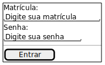
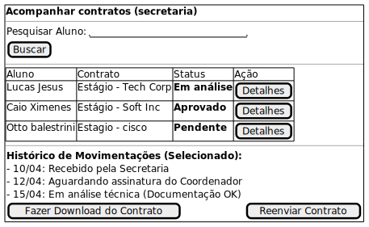
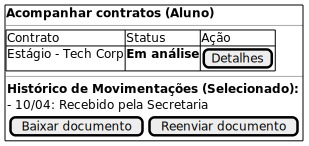
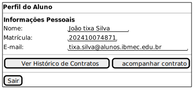
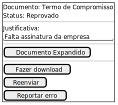
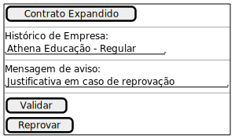
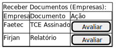
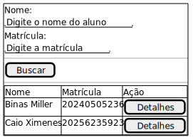

## 🚀 Introdução

Um protótipo de baixa fidelidade é uma representação visual simplificada de um sistema ou aplicação, voltada para comunicação universal de suas funcionalidades e fluxos. A ideia não é que sejam técnicos nem bonitos mas sim que permitam validar de maneira palpável as ideias da equipe e permitir maior entendimento do funcionamento da aplicação.

## 🛠️ Metodologia

Iniciamos a concepção do protótipo através de levantamentos,discussões e mapas mentais em equipe sobre as necessidades dos usuários finais, Secretaria e Aluno (Brainstorming).

## 📐 Protótipo de Baixa Fidelidade

### 🧩 Componentes

Prioridade: D - Desejável, O - Opcional

* [Modal de anexar contrato](#anexar-documentos)
* [Tela de login](#login)

  - Login com matricula e senha.
  - Esqueci minha senha. - D
  - OAuth Microsoft. - O
* [Tela de contrato](#tela-contratos)

  - Documentos com nome e status. Status do processo de estágio (Parecido com mercado livre no envio de encomenda).
  - Filtragem de Documentos. - D
* [Tela de perfil](#tela-perfil-aluno)

  - Informações do usuário.
* [Tela de detalhes do documento](#tela-de-detalhes-do-documento)

  - Documento expandido, Informações da validação, status, Justificativa do status (caso erro), Botão de download, Botão de reenvio, Botão de report - D.
* [Tela de avaliação de contrato](#tela-de-avaliacao-de-contrato)

  - Tela de detalhes do documento + opções de : validar, reprovar, mensagem de aviso (opcional).
  - Tela de Historico de empresas - O
* [Tela Secretaria -> Empresa de Estágio](#tela-secretaria---empresa-de-estagio)

  - Receber contrato das empresas Estagiarias do aluno para validação
* [Tela de busca de alunos (Secretaria)](#tela-de-busca-de-alunos-secretaria)

  - Nome
  - Matricula - D

### Login

Tela de login que permitirá entrar com matrícula e senha já utilizadas pelo aluno no sitema do IBMEC.

### Tela contratos

Tela de contrato para secretaria e aluno, permite acompanhar os contratos pendentes.

#### Secretaria

#### Aluno

### Tela perfil (aluno)

Informações do perfil do aluno.

### Tela de detalhes do documento

Tela com os detalhes do documento, mostrando o status da validação e opções para baixar ou reenviar o arquivo.

### Tela de avaliação de contrato

Tela para a secretaria avaliar o contrato do aluno, com opções rápidas para validar, reprovar ou enviar avisos.

### Tela Secretaria

Tela para a secretaria receber e gerenciar os contratos enviados diretamente pelo aluno.

### Tela de busca de alunos (Secretaria)

Tela para a secretaria buscar alunos cadastrados no sistema através do nome ou matrícula.

## Conclusão

A elaboração do protótipo de baixa fidelidade permitiu à equipe visualizar a jornada do usuário de ponta a ponta. Com a definição clara do fluxo de telas, estrutura dos menus, botões de ação e a priorização visual das funcionalidades. Isso nos garante uma base validada e segura para as próximas etapas do projeto.

## Autor(es)

| Data     | Versão | Descrição                      | Autor(es)                                                                      |
| -------- | ------- | -------------------------------- | ------------------------------------------------------------------------------ |
| 10/04/26 | 1.0     | Elaboração das primeiras telas | Lucas jesus, Otto Balestrassi, Caio Ximenes, Bernardo Esteves e Daniel Alberto |

### Anexar Documentos
