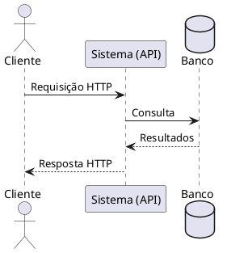

# 📊 Guia de Diagramas (PlantUML)

Este projeto utiliza a ferramenta **PlantUML** em conjunto com o plugin `mkdocs-build-plantuml-plugin` para gerar e renderizar diagramas automaticamente nas páginas da documentação.

---

## 🛠️ Como Funciona?

O plugin está configurado para ler os scripts de diagramas (arquivos `.puml`) na pasta raiz **`src/`** e convertê-los automaticamente para imagens vetoriais (arquivos `.svg`) na pasta **`out/`** sempre que a documentação for compilada ou servida.

Essa estrutura evita que o repositório fique poluído com imagens geradas manualmente e garante que os diagramas estejam sempre atualizados com base no código-fonte.

---

## 📝 Como criar um novo diagrama

### Passo 1: Escrever o script
Crie um arquivo com a extensão `.puml` (por exemplo, `meu_diagrama.puml`) **dentro da pasta `src/`**:



### Passo 2: Executar o MkDocs
Se você estiver rodando `mkdocs serve`, o diagrama será compilado em tempo real. Se não, ao buildar a documentação com `mkdocs build`, o plugin irá criar automaticamente a imagem:
* `docs/assets/Diagramas/out/meu_diagrama.svg`

### Passo 3: Implementar o gráfico na página
Para adicionar o diagrama recém-criado em qualquer página `.md` da sua documentação (ex: na pasta `docs/Elaboracao/`), utilize a sintaxe padrão de imagem do Markdown apontando para o arquivo gerado na pasta `out/`.

Lembre-se de usar o caminho relativo correto. Por exemplo, se você está editando `docs/Iniciacao/mapa_mental.md`, o caminho seria:

```markdown

```

Pronto! O diagrama aparecerá renderizado perfeitamente na sua documentação.
