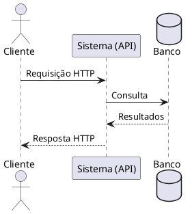
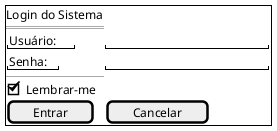

# 📊 Guia de Diagramas (PlantUML)

Este projeto utiliza a ferramenta **PlantUML** em conjunto com o plugin `mkdocs-build-plantuml-plugin` para gerar e renderizar diagramas automaticamente nas páginas da documentação.

---

## 🛠️ Como Funciona?

O plugin está configurado para ler os scripts de diagramas (arquivos `.puml`) na pasta raiz **`src/`** e convertê-los automaticamente para imagens vetoriais (arquivos `.svg`) na pasta **`out/`** sempre que a documentação for compilada ou servida.

Essa estrutura evita que o repositório fique poluído com imagens geradas manualmente e garante que os diagramas estejam sempre atualizados com base no código-fonte.

---

## 📝 Como criar um novo diagrama

### Passo 1: Escrever o script
Crie um arquivo com a extensão `.puml` (por exemplo, `meu_diagrama.puml`) **dentro da pasta `src/`**:



### Passo 2: Executar o MkDocs
Se você estiver rodando `mkdocs serve`, o diagrama será compilado em tempo real. Se não, ao buildar a documentação com `mkdocs build`, o plugin irá criar automaticamente a imagem:
* `docs/assets/Diagramas/out/meu_diagrama.svg`

### Passo 3: Implementar o gráfico na página
Para adicionar o diagrama recém-criado em qualquer página `.md` da sua documentação (ex: na pasta `docs/Elaboracao/`), utilize a sintaxe padrão de imagem do Markdown apontando para o arquivo gerado na pasta `out/`.

Lembre-se de usar o caminho relativo correto. Por exemplo, se você está editando `docs/Iniciacao/mapa_mental.md`, o caminho seria:

```markdown

```

Pronto! O diagrama aparecerá renderizado perfeitamente na sua documentação.

---

## 📖 Catálogo de Sintaxe PlantUML

Referência rápida dos comandos e sintaxes mais utilizados no PlantUML, organizados por categoria.

---

### 🔧 Estrutura Básica

| Sintaxe | Função | Resultado |
|---|---|---|
| `@startuml` | Inicia um bloco de diagrama UML | Marca o começo do código do diagrama |
| `@enduml` | Finaliza um bloco de diagrama UML | Marca o fim do código do diagrama |
| `' comentário` | Comentário de linha única | Texto ignorado pelo compilador |
| `/' comentário '/` | Comentário de múltiplas linhas | Bloco de texto ignorado pelo compilador |
| `title Meu Título` | Define o título do diagrama | Texto centralizado no topo do diagrama |
| `header Cabeçalho` | Adiciona um cabeçalho | Texto exibido acima do diagrama |
| `footer Rodapé` | Adiciona um rodapé | Texto exibido abaixo do diagrama |
| `caption Legenda` | Adiciona uma legenda | Texto descritivo abaixo do diagrama |
| `scale 1.5` | Define a escala do diagrama | Diagrama renderizado 1.5x maior |
| `skinparam monochrome true` | Ativa modo monocromático | Diagrama em preto e branco |

---

### 👤 Participantes (Diagrama de Sequência)

| Sintaxe | Função | Resultado |
|---|---|---|
| `actor Nome` | Cria um ator (boneco palito) | Ícone de pessoa com o nome abaixo |
| `participant Nome` | Cria um participante genérico | Caixa retangular com o nome |
| `participant "Nome Longo" as N` | Cria participante com alias | Caixa com nome longo, referenciado como `N` |
| `boundary Nome` | Cria um boundary (limite) | Ícone de fronteira do sistema |
| `control Nome` | Cria um controle | Ícone de componente de controle |
| `entity Nome` | Cria uma entidade | Ícone de entidade de dados |
| `database Nome` | Cria um banco de dados | Ícone cilíndrico de banco de dados |
| `collections Nome` | Cria uma coleção | Ícone de coleção de objetos |
| `queue Nome` | Cria uma fila | Ícone de fila de mensagens |

---

### ➡️ Setas e Mensagens (Diagrama de Sequência)

| Sintaxe | Função | Resultado |
|---|---|---|
| `A -> B : Msg` | Mensagem síncrona (linha contínua) | Seta contínua com ponta preenchida de A para B |
| `A --> B : Msg` | Resposta / retorno (linha tracejada) | Seta tracejada com ponta preenchida de A para B |
| `A ->> B : Msg` | Mensagem assíncrona (ponta fina) | Seta contínua com ponta aberta de A para B |
| `A -->> B : Msg` | Retorno assíncrono | Seta tracejada com ponta aberta de A para B |
| `A -x B : Msg` | Mensagem perdida / destruída | Seta com X na ponta (mensagem não entregue) |
| `A ->o B : Msg` | Mensagem com círculo na ponta | Seta com ponta circular |
| `A <-> B : Msg` | Mensagem bidirecional | Seta com pontas nos dois lados |
| `A -> A : Auto-msg` | Auto-chamada | Seta que sai e retorna ao mesmo participante |
| `A -[#red]> B : Msg` | Seta colorida | Seta na cor vermelha |
| `A -[#blue,dashed]-> B` | Seta estilizada | Seta azul e tracejada |

---

### 📌 Notas

| Sintaxe | Função | Resultado |
|---|---|---|
| `note left : Texto` | Nota à esquerda do último participante | Post-it amarelo à esquerda |
| `note right : Texto` | Nota à direita do último participante | Post-it amarelo à direita |
| `note over A : Texto` | Nota sobre um participante | Post-it sobre o participante A |
| `note over A, B : Texto` | Nota entre dois participantes | Post-it abrangendo A e B |
| `note left of A : Texto` | Nota à esquerda de A | Post-it posicionado à esquerda de A |
| `note right of A : Texto` | Nota à direita de A | Post-it posicionado à direita de A |
| `hnote over A : Texto` | Nota hexagonal | Nota com formato hexagonal |
| `rnote over A : Texto` | Nota retangular | Nota com bordas retas (sem cantos arredondados) |

---

### 📦 Agrupamentos e Blocos (Diagrama de Sequência)

| Sintaxe | Função | Resultado |
|---|---|---|
| `alt Condição` | Bloco alternativo (if/else) | Caixa com rótulo "alt" |
| `else Outra condição` | Ramo alternativo | Divisória dentro do bloco alt |
| `end` | Finaliza qualquer bloco | Fecha o agrupamento atual |
| `opt Condição` | Bloco opcional | Caixa com rótulo "opt" (executa 0 ou 1 vez) |
| `loop N vezes` | Bloco de repetição | Caixa com rótulo "loop" |
| `par` | Bloco paralelo | Dois ou mais fluxos executados simultaneamente |
| `break Condição` | Interrupção do fluxo | Caixa de interrupção no diagrama |
| `critical` | Região crítica | Bloco que indica seção crítica |
| `group Rótulo` | Agrupamento genérico | Caixa com rótulo customizado |
| `ref over A, B : Referência` | Referência a outro diagrama | Caixa de referência abrangendo participantes |
| `== Separador ==` | Separador visual | Linha horizontal com texto no meio |
| `...` | Atraso / espaço | Espaço vertical indicando passagem de tempo |
| `|||` | Espaço extra | Espaçamento vertical adicional |

---

### 🎨 Estilização (skinparam)

| Sintaxe | Função | Resultado |
|---|---|---|
| `skinparam backgroundColor #FAFAFA` | Cor de fundo do diagrama | Fundo na cor especificada |
| `skinparam sequenceArrowColor #333` | Cor das setas de sequência | Setas na cor especificada |
| `skinparam participantBorderColor #555` | Cor da borda dos participantes | Bordas dos participantes estilizadas |
| `skinparam participantBackgroundColor #E8F5E9` | Cor de fundo dos participantes | Fundo colorido nos participantes |
| `skinparam noteBorderColor #FFA000` | Cor da borda das notas | Notas com borda na cor especificada |
| `skinparam noteBackgroundColor #FFF8E1` | Cor de fundo das notas | Notas com fundo na cor especificada |
| `skinparam shadowing false` | Remove sombras | Diagrama sem efeito de sombra |
| `skinparam handwritten true` | Estilo "feito à mão" | Diagrama com traço irregular estilizado |
| `skinparam defaultFontName "Arial"` | Define a fonte padrão | Todo texto usa a fonte especificada |
| `skinparam defaultFontSize 14` | Define o tamanho da fonte | Texto renderizado no tamanho indicado |
| `skinparam roundCorner 15` | Cantos arredondados | Elementos com bordas arredondadas |

---

### 🏗️ Diagrama de Classes

| Sintaxe | Função | Resultado |
|---|---|---|
| `class NomeClasse` | Declara uma classe | Caixa com o nome da classe |
| `class NomeClasse { }` | Classe com corpo | Caixa com seções de atributos/métodos |
| `+ atributo : Tipo` | Atributo público | Campo com ícone de visibilidade pública |
| `- atributo : Tipo` | Atributo privado | Campo com ícone de visibilidade privada |
| `# atributo : Tipo` | Atributo protegido | Campo com ícone de visibilidade protegida |
| `~ atributo : Tipo` | Atributo package-private | Campo com visibilidade de pacote |
| `{abstract}` | Marca classe/método como abstrato | Nome em itálico |
| `{static}` | Marca atributo/método como estático | Nome sublinhado |
| `interface NomeInterface` | Declara uma interface | Caixa com estereótipo «interface» |
| `abstract class Nome` | Declara classe abstrata | Caixa com nome em itálico |
| `enum NomeEnum` | Declara uma enumeração | Caixa com estereótipo «enum» |
| `A <\|-- B` | Herança (B herda de A) | Seta com triângulo vazio apontando para A |
| `A <\|.. B` | Implementação (B implementa A) | Seta tracejada com triângulo vazio |
| `A *-- B` | Composição | Seta com losango preenchido em A |
| `A o-- B` | Agregação | Seta com losango vazio em A |
| `A --> B` | Dependência / associação direcional | Seta simples de A para B |
| `A -- B` | Associação | Linha simples entre A e B |
| `A "1" -- "0..*" B` | Multiplicidade | Números nas pontas indicando cardinalidade |
| `package "Nome" { }` | Pacote agrupador | Caixa que agrupa classes relacionadas |
| `together { }` | Força proximidade visual | Elementos dentro ficam visualmente agrupados |

---

### 🎯 Diagrama de Casos de Uso

| Sintaxe | Função | Resultado |
|---|---|---|
| `usecase "Nome" as UC1` | Cria um caso de uso | Elipse com o nome |
| `actor "Nome" as A1` | Cria um ator | Boneco palito com o nome |
| `A1 --> UC1` | Associação ator → caso de uso | Linha conectando ator ao caso |
| `UC1 .> UC2 : <<include>>` | Relacionamento Include | Seta tracejada com estereótipo «include» |
| `UC1 .> UC3 : <<extend>>` | Relacionamento Extend | Seta tracejada com estereótipo «extend» |
| `UC1 -\|> UC4` | Generalização de caso de uso | Seta com triângulo vazio (herança) |
| `rectangle "Sistema" { }` | Fronteira do sistema | Retângulo englobando os casos de uso |

---

### 🔄 Diagrama de Atividades

| Sintaxe | Função | Resultado |
|---|---|---|
| `start` | Início do fluxo | Círculo preto preenchido |
| `stop` | Fim do fluxo | Círculo preto preenchido com borda |
| `end` | Fim alternativo | Símbolo de finalização |
| `:Ação;` | Ação / atividade | Retângulo arredondado com o texto |
| `if (Condição?) then (sim)` | Início de decisão | Losango com rótulos |
| `else (não)` | Ramo alternativo da decisão | Caminho alternativo no losango |
| `elseif (Cond?) then (sim)` | Ramo adicional | Outro caminho condicional |
| `endif` | Fim da decisão | Fecha o bloco de decisão |
| `fork` | Início de fluxo paralelo | Barra horizontal de sincronização |
| `fork again` | Outro ramo paralelo | Novo caminho paralelo |
| `end fork` | Fim de fluxo paralelo | Barra de junção dos fluxos |
| `switch (Variável?)` | Início de switch | Bloco de decisão múltipla |
| `case (Valor)` | Ramo do switch | Caminho para o valor especificado |
| `endswitch` | Fim do switch | Fecha o bloco switch |
| `while (Condição?) is (sim)` | Loop while | Estrutura de repetição |
| `endwhile (não)` | Fim do loop | Saída do loop |
| `repeat` | Início de repeat-while | Estrutura de repetição do-while |
| `repeat while (Cond?)` | Condição do repeat | Volta ao início se verdadeiro |
| `\|Raia\|` | Raia (swimlane) | Divisão vertical do diagrama por responsável |
| `#palegreen :Ação;` | Ação colorida | Ação com cor de fundo personalizada |
| `detach` | Desconecta o fluxo | Interrompe um caminho sem conectar |

---

### 🔵 Diagrama de Estados

| Sintaxe | Função | Resultado |
|---|---|---|
| `[*] --> Estado1` | Transição do estado inicial | Ponto preto → primeiro estado |
| `Estado1 --> Estado2 : Evento` | Transição entre estados | Seta com rótulo do evento |
| `Estado2 --> [*]` | Transição para o estado final | Estado → ponto preto com borda |
| `state "Nome Longo" as E1` | Estado com alias | Retângulo arredondado com nome longo |
| `state Estado1 { }` | Estado composto (subestados) | Estado com sub-diagrama interno |
| `state fork_state <<fork>>` | Pseudo-estado fork | Barra de bifurcação |
| `state join_state <<join>>` | Pseudo-estado join | Barra de junção |
| `state choice_state <<choice>>` | Pseudo-estado choice | Losango de decisão |
| `Estado1 : entry / ação` | Ação de entrada | Ação executada ao entrar no estado |
| `Estado1 : exit / ação` | Ação de saída | Ação executada ao sair do estado |
| `Estado1 : do / atividade` | Atividade interna | Ação contínua enquanto no estado |
| `--` | Separador de regiões concorrentes | Divide em regiões paralelas |
| `Estado1 -[#blue]-> Estado2` | Transição colorida | Seta na cor especificada |

---

### 🧩 Diagrama de Componentes e Implantação

| Sintaxe | Função | Resultado |
|---|---|---|
| `[Componente]` | Cria um componente | Caixa com ícone de componente |
| `component "Nome" as C1` | Componente com alias | Componente nomeado e referenciável |
| `interface "Nome" as I1` | Cria uma interface | Círculo pequeno (lollipop) |
| `C1 -- I1` | Componente fornece interface | Linha conectando componente à interface |
| `C2 ..> I1 : usa` | Componente usa interface | Seta tracejada indicando uso |
| `node "Servidor" { }` | Nó de implantação | Cubo 3D representando servidor |
| `database "BD" as db` | Banco de dados | Ícone cilíndrico |
| `cloud "Nuvem" { }` | Nuvem | Forma de nuvem agrupadora |
| `folder "Pasta" { }` | Pasta | Ícone de diretório |
| `artifact "arquivo.jar"` | Artefato | Ícone de arquivo/pacote |
| `storage "Disco" as S1` | Armazenamento | Ícone de dispositivo de storage |
| `frame "Sistema" { }` | Moldura | Retângulo com título no canto |
| `C1 --> C2 : Protocolo` | Conexão entre componentes | Seta com rótulo do protocolo |
| `portin` / `portout` | Portas de entrada/saída | Quadrados nas bordas dos componentes |

---

### 🖼️ Salt (Wireframes / Protótipos de Interface)

Salt é o módulo do PlantUML para criar wireframes e mockups de interfaces gráficas.
É obrigatório que o conteúdo esteja entre chaves.

#### Estrutura e Inicialização

| Sintaxe | Função | Resultado |
|---|---|---|
| `@startsalt` / `@endsalt` | Inicia/finaliza um wireframe Salt | Bloco dedicado a interface gráfica |
| `salt { ... }` | Bloco Salt dentro de `@startuml` | Wireframe embutido em diagrama UML |
| `{` / `}` | Delimitadores de container | Agrupa widgets dentro de um painel |

#### Widgets de Entrada e Exibição

| Sintaxe | Função | Resultado |
|---|---|---|
| `"Texto"` | Label / texto estático | Texto exibido na interface |
| `"Insira aqui"` | Campo de texto (input) | Caixa de entrada de texto |
| `"**Negrito**"` | Texto em negrito | Label com formatação negrito |
| `<u>Texto</u>` | Texto sublinhado | Label com sublinhado |
| `[Botão]` | Botão clicável | Botão retangular com texto |
| `()  Opção` | Radio button desmarcado | Círculo vazio + texto |
| `(X) Opção` | Radio button marcado | Círculo preenchido + texto |
| `[]  Opção` | Checkbox desmarcada | Quadrado vazio + texto |
| `[X] Opção` | Checkbox marcada | Quadrado com check + texto |
| `^Item1^Item2^Item3^` | Dropdown / combobox | Lista suspensa com opções |
| `{SI` / `}` | Campo de texto multilinha | Área de texto (textarea) |
| `{S` / `}` | Sublayout com scroll | Painel com barra de rolagem |

#### Layout e Organização

| Sintaxe | Função | Resultado |
|---|---|---|
| `{+` / `}` | Container com borda | Painel com moldura visível |
| `{^` / `}` | Container com abas (tabs) | Painel com abas no topo |
| `{#` / `}` | Layout em grade (tabela) | Elementos organizados em grid |
| `{!` / `}` | Layout sem borda | Container invisível |
| `{-` / `}` | Separador (linha horizontal) | Linha divisória entre seções |
| `--` | Separador horizontal | Linha horizontal dentro do container |
| `..` | Separador pontilhado | Linha pontilhada horizontal |
| `==` | Separador duplo | Linha dupla horizontal |
| `~~` | Separador ondulado | Linha ondulada horizontal |
| `\|` | Separador vertical (em tabelas) | Divisor de colunas no grid |
| `.` | Célula vazia (em grid) | Espaço em branco na grade |

#### Árvores e Menus

| Sintaxe | Função | Resultado |
|---|---|---|
| `{T` / `}` | Componente de árvore (tree) | Estrutura hierárquica expansível |
| `+ Nó pai` | Nó de primeiro nível da árvore | Item raiz da árvore |
| `++ Nó filho` | Nó de segundo nível | Sub-item indentado |
| `+++ Nó neto` | Nó de terceiro nível | Sub-sub-item indentado |
| `{M` / `}` | Menu (barra de menu) | Barra de menus no topo |
| `{T!` / `}` | Árvore sem borda | Árvore sem moldura visível |

#### Exemplo Completo de Wireframe



---

### 🛠️ Comandos Úteis e Diversos

| Sintaxe | Função | Resultado |
|---|---|---|
| `!include arquivo.puml` | Inclui outro arquivo PUML | Importa definições de outro arquivo |
| `!define NOME valor` | Define uma constante | Substitui `NOME` por `valor` no código |
| `!ifdef NOME` | Condicional de compilação | Só processa o bloco se NOME estiver definido |
| `!theme cerulean` | Aplica um tema visual | Diagrama com paleta de cores do tema |
| `left to right direction` | Muda a direção do diagrama | Elementos organizados da esquerda para direita |
| `top to bottom direction` | Direção padrão (cima → baixo) | Elementos organizados de cima para baixo |
| `hide footbox` | Oculta a caixa inferior (sequência) | Remove as barras inferiores dos participantes |
| `autonumber` | Numera mensagens automaticamente | Cada mensagem recebe um número sequencial |
| `autonumber 10 5` | Numeração customizada (início, passo) | Numeração começando em 10, incrementando 5 |
| `newpage` | Quebra de página | Divide o diagrama em múltiplas páginas |
| `legend` / `end legend` | Bloco de legenda | Caixa de legenda no diagrama |
| `together { }` | Agrupa elementos visualmente | Elementos ficam próximos no layout |
| `remove @unlinked` | Remove elementos não conectados | Limpa participantes/objetos sem relações |
| `hide empty members` | Oculta seções vazias (classes) | Classes sem atributos/métodos ficam compactas |
